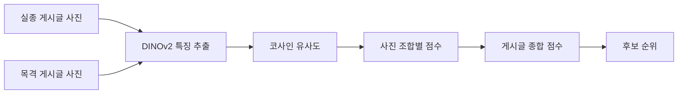

# 발자국 AI 매칭 서버 (Footprint Match AI)

> 실종 반려동물의 여러 사진과 목격 제보 사진을 비교해 닮은 후보를 찾는 이미지 특징 기반 매칭 API입니다.

이 저장소는 발자국 전체 커뮤니티 서비스 중 **AI 이미지 매칭 기능을 담당하는 FastAPI 서버**입니다. 실종 게시글과 목격 게시글의 사진 조합을 비교하고, DINOv2 특징 벡터의 코사인 유사도를 이용해 후보 순위를 계산합니다.

## 담당 범위

- DINOv2 기반 이미지 특징 추출과 유사도 비교 모듈 구현
- 여러 장의 실종·목격 사진을 조합해 비교하는 게시글 단위 점수 설계
- 여러 목격 게시글을 비교하고 유사 후보를 정렬하는 검색 흐름 구현
- Spring Boot 서비스가 호출할 수 있는 FastAPI 업로드 API 구성
- 모델 비교 및 점수 검증용 실험 스크립트 작성

## 핵심 동작



1. 업로드된 이미지를 RGB로 변환하고 224×224 크기로 전처리합니다.
2. DINOv2 ViT-S/14 모델로 특징 벡터를 추출하고 L2 정규화합니다.
3. 실종 사진과 목격 사진의 모든 조합에 대해 코사인 유사도를 계산합니다.
4. 최고점 40%와 상위 3개 평균 60%를 결합해 게시글 종합 점수를 만듭니다.
5. 여러 목격 게시글을 종합 점수 순으로 정렬해 후보 목록을 제공합니다.

> 점수는 같은 동물일 확률이 아니라 이미지 특징의 유사도입니다. 실제 후보 판정 임계값은 충분한 데이터 검증 후 결정해야 합니다.

## API

### 상태 확인

```http
GET /
```

### 단일 이미지 비교

```http
POST /compare
Content-Type: multipart/form-data
```

### 게시글 단위 다중 이미지 비교

```http
POST /compare-posts
Content-Type: multipart/form-data
```

실종 게시글 사진과 목격 게시글 사진을 각각 여러 장 전달하면 다음 값을 반환합니다.

- `highest_score`: 전체 조합 중 최고 유사도
- `top_average`: 상위 3개 조합의 평균
- `all_average`: 전체 조합 평균
- `combined_score`: 최고점과 상위 평균을 결합한 종합 점수

## 기술 스택

| 구분 | 기술 |
| --- | --- |
| Language | Python |
| API | FastAPI, Uvicorn |
| AI Model | DINOv2 ViT-S/14 |
| ML | PyTorch, Torchvision |
| Image | Pillow |
| Calculation | NumPy, Cosine Similarity |

## 프로젝트 구조

```text
footprint-match-ai
├─ main.py                  # FastAPI 엔드포인트
├─ dinov2_matcher.py        # 특징 추출·유사도 계산
├─ post_matcher.py          # 다중 이미지 게시글 비교
├─ candidate_searcher.py    # 목격 후보 검색·정렬
├─ compare_models.py        # 모델 비교 실험
├─ compare_three_models.py  # 세 모델 비교 실험
├─ validate_matcher.py      # 점수 검증
├─ test_match.py            # 기본 실행 테스트
└─ requirements.txt
```

## 로컬 실행

```bash
python -m venv .venv
```

Windows:

```powershell
.venv\Scripts\activate
pip install -r requirements.txt
uvicorn main:app --reload --port 8000
```

서버 실행 후 `http://127.0.0.1:8000/docs`에서 API를 확인할 수 있습니다.

## 트러블슈팅과 설계 판단

### 최고점 하나에만 의존하는 문제

여러 사진 중 우연히 한 조합만 높은 경우 전체 게시글이 과대평가될 수 있어, 최고점과 상위 3개 평균을 결합했습니다.

### 사진 수가 다른 게시글 비교

모든 사진 조합을 비교하고 동일한 요약 지표를 반환하여 게시글마다 사진 수가 달라도 후보를 정렬할 수 있도록 구성했습니다.

### 확률로 오해할 수 있는 점수

유사도 점수를 동일 개체 확률로 표현하지 않고, API 응답과 사용자 안내에서 이미지 특징 기반 점수임을 명시했습니다.

## 향후 개선

- 실제 실종·목격 데이터셋을 이용한 임계값 검증
- 동물 종류·품종·색상 등 메타데이터를 결합한 1차 후보 필터링
- 특징 벡터 캐시를 통한 반복 추론 감소
- GPU 배포 및 배치 추론 최적화
- 잘못된 후보에 대한 사용자 피드백 학습 구조 추가
